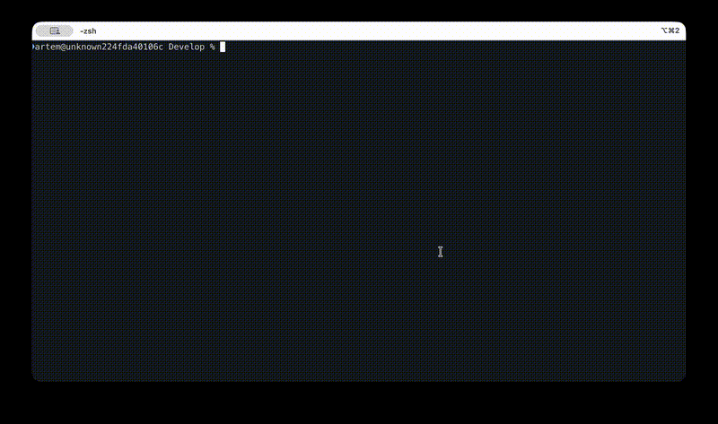

# drift

**Lightweight project tracker for AI-assisted coders. Terminal TUI + CLI.**

[](https://goreportcard.com/report/github.com/snowtema/drift)
[](https://github.com/snowtema/drift/releases)
[](LICENSE)
[](https://pkg.go.dev/github.com/snowtema/drift)

> Track dozens of vibe-code projects without leaving your terminal. Single binary, zero dependencies.



## Why drift?

You vibe-code 3-7 projects a day with Claude, Cursor, v0. After a week you have 20+ folders and can't remember what each one does, where you left off, or which ones are worth continuing.

Jira is overkill. Notion is too slow. You need something that works at the speed of `ls`.

**drift** is a file-based project tracker that lives in your terminal:
- **Fullscreen TUI** — dual-panel, keyboard-driven, no flicker
- **Fast CLI** — all commands work without TUI
- **Open protocol** — plain JSON `.drift/` files, no database, no server
- **Auto-enrichment** — detects stack, repo URL, deploy links
- **Claude Code integration** — launch Claude from TUI, auto-sync via CLAUDE.md
- **Single binary** — 5MB Go binary, zero runtime dependencies

## Install

**Homebrew** (macOS/Linux):
```bash
brew install snowtema/tap/drift
```

**Go install** (requires Go 1.21+):
```bash
go install github.com/snowtema/drift/cmd@latest
```

**Binary download:**
Grab a prebuilt binary from [Releases](https://github.com/snowtema/drift/releases).

**From source:**
```bash
git clone https://github.com/snowtema/drift
cd drift
go build -o drift ./cmd/
```

## Quick Start

```bash
# Initialize drift in your project
cd ~/my-project
drift init

# Add goals and notes
drift goal "MVP landing page"
drift goal "Stripe integration"
drift note "scaffolded with create-next-app"

# Mark goal done
drift goal done 1

# See status
drift status

# Scan a directory for all projects
drift scan ~/Develop --depth=2 --init

# Open fullscreen TUI
drift
```

## TUI Keyboard Shortcuts

Fullscreen dual-panel interface. Press `?` inside for full reference.

| Key | Action |
|-----|--------|
| `j/k` or arrows | Navigate projects |
| `Enter` | Open project detail |
| `Esc` | Back to list |
| `Tab` | Cycle sections (info/goals/notes) |
| `Space/Enter` | Toggle goal done |
| `n` | Add note |
| `g` | Add goal |
| `1-5` | Set status (active/idea/paused/done/abandoned) |
| `s` | Cycle sort (recent/progress/name/status) |
| `t` | Toggle tree/flat view |
| `/` | Live filter |
| `c` | Open Claude Code in project |
| `?` | Full help |

## CLI Commands

All commands work without the TUI:

```bash
drift init [dir]              # Initialize project tracking
drift status                  # Show current project status
drift list [--sort=MODE]      # List all tracked projects
drift note "text"             # Add a note
drift goal "text"             # Add a goal
drift goal done N             # Mark goal #N done
drift progress N              # Set progress (0-100)
drift set-status STATUS       # Change project status
drift describe "text"         # Set description
drift tag tag1 tag2           # Add tags
drift link type url           # Set a link (repo/deploy/design)
drift scan [dir] [--depth=N]  # Find untracked projects
drift scan --init [dir]       # Find and auto-init all
drift open name               # Get project path
drift help                    # Show help
```

## Claude Code Integration

drift integrates with Claude Code in three ways:

**1. Launch from TUI:** Press `c` in project detail to open an interactive Claude Code session in that project directory.

**2. Auto-tracking via CLAUDE.md:** `drift init` adds a `## drift` section to the project's CLAUDE.md. Claude Code reads this at session start and automatically maintains notes and goals in `.drift/project.json` as it works.

**3. Claude Code skill:** Copy `skills/drift/SKILL.md` to `~/.claude/skills/drift/` for `/drift` commands inside Claude Code sessions.

## Protocol

drift is **protocol-first**. The `.drift/` file format is the product. CLI and TUI are just consumers.

```
your-project/
  .drift/
    project.json    # project metadata, goals, notes

~/.drift/
  registry.json     # index of all your projects
```

Anyone can build a drift-compatible tool. As long as it reads/writes `.drift/project.json`, it works.

- [Protocol Specification](docs/protocol.md)
- [JSON Schema: project.json](docs/schema/project.schema.json)
- [JSON Schema: registry.json](docs/schema/registry.schema.json)

## Design Principles

- **File-based** — plain JSON, no database, no server
- **Zero-friction** — `drift init` and you're done
- **Auto-enrichment** — detects stack, repo URL from git/package.json/etc.
- **Tool-agnostic** — works with Claude, Cursor, any AI, or no AI at all
- **Local-first** — your data stays on your machine
- **Single binary** — 5MB Go binary, zero runtime dependencies

## Contributing

Contributions welcome! Feel free to open issues and pull requests.

## License

[MIT](LICENSE)
